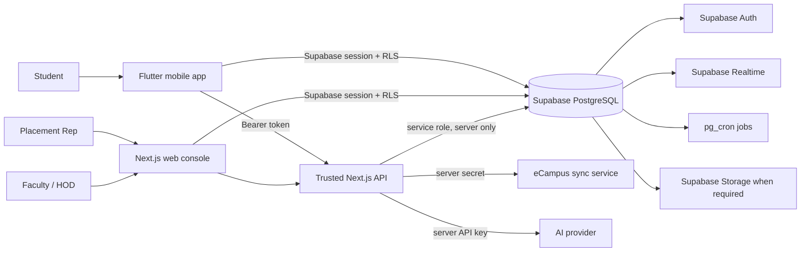

# PSGMX Application Architecture and Improvement Report

**Prepared:** 28 August 2026
**Active cohorts:** 25MX and 26MX · **lifecycle-ready cohorts:** 27MX–31MX
**Release baseline:** v4.0.1 — web, Android, authentication, roster and delivery hardening completed and verified.

## 1. Executive summary

PSGMX is best positioned as the daily placement operating system for PSG Tech MCA—not as another broad college portal. Its strongest product loop is a short, repeatable routine that answers four questions for a student:

1. Is my academic attendance safe?
2. What should I practise today?
3. Did I complete today’s Daily Five and quest?
4. Am I becoming more placement-ready?

The application now has a clearer division of responsibility:

- The **mobile app** is the student’s daily five-minute experience.
- The **Placement Rep web console** is the operational control panel for the Rep’s own batch.
- **Supabase** is the identity, authorization, data, realtime and scheduling foundation.
- The **Next.js API** protects private integrations, OTP eligibility checks, eCampus credentials and AI keys.
- Faculty and HOD access remains a governance layer; it is not mixed into normal student administration.

The most important technical repair is the new logical identity model. A 26MX student may start with a personal email, receive a college email later, and use either approved address without creating two student profiles or losing attendance, streak, readiness, tasks or history.

Release v4.0.1 completes that model for the supplied roster, adds passwordless alumni onboarding, gives junior cohorts a safe in-app LeetCode setup path, hardens faculty OTP access and makes the Android release pipeline reproducible. The senior architecture pass also removes high-trust demo data from core student, faculty and alumni surfaces; when live data is absent, the application now says so clearly and offers the next useful action.

## 2. Product purpose

PSGMX should reduce the daily effort required to prepare consistently for placements. It is useful when it turns fragmented information into a small number of clear actions.

The product should not try to duplicate all of eCampus. In the redesigned experience, eCampus contributes only:

- overall academic attendance percentage;
- subject-level academic attendance;
- hours attended versus total hours;
- the number of hours that must be attended to recover to 75%, or may be missed while staying above 75%.

CGPA, CA marks and CA examination dates/timetables are intentionally excluded from the student experience.

## 3. Cohort behaviour

### 25MX

25MX is the active senior cohort. Its mobile experience includes:

- the common Today loop;
- academic attendance;
- Daily Five;
- assigned placement/core quests;
- readiness and LeetCode progress;
- company drives;
- the senior placement-experience log;
- batch announcements.

Its Placement Rep controls only 25MX operational data unless a faculty or HOD account performs a governance action.

### 26MX

26MX is prepared as the active-junior cohort. Migration 16 loads the supplied roster and promotes the batch from `pending_onboarding` to `active_junior`. Its mobile experience includes:

- personal-email OTP immediately, plus the predictable college alias `register-number@psgtech.ac.in`;
- the same common Today loop;
- academic attendance;
- Daily Five;
- foundational project, aptitude, DSA and core quests;
- readiness progress;
- batch announcements.

The senior placement-experience log is hidden from 26MX navigation until the batch becomes `active_senior`. The information can still be introduced later as a deliberate senior-year feature rather than cluttering first-year onboarding.

LeetCode can be connected from the Profile or the 26MX Today prompt. The app accepts either a username or a full `leetcode.com/u/...` profile URL, normalizes it to one username and rejects malformed input before saving.

### Alumni

Graduated MCA users now have a dedicated passwordless path:

1. enter full name, MCA register number, OTP email and optional LinkedIn profile;
2. the admission batch and graduation year are derived from the register number;
3. active 25MX/26MX register numbers are redirected to normal Student OTP instead of being duplicated as alumni;
4. the alumni profile and approved roster identity are linked to the graduated batch;
5. a six-digit OTP opens the alumni workspace—no alumni password is stored or requested.

The desktop flow uses the same visual system as the main login, while mobile collapses to a focused single-column form. Validation covers register format, batch lifecycle, email conflicts, name length and HTTPS LinkedIn URLs.

## 4. System architecture



### Mobile layer

The Flutter app contains student-facing workflows only. Its primary navigation is:

- Today;
- Quests;
- Placement Log for active seniors only;
- Attendance;
- Profile.

Administrative mobile routes for member permissions, team configuration, session scheduling, question management, bulk upload and command-centre operations have been removed from routing.

### Web layer

The Next.js application contains role-aware portals and trusted API routes. The Placement Rep area now includes:

- Command Center;
- Members & Access;
- Team Management;
- Session Scheduling;
- Attendance;
- Daily Tasks;
- Companies;
- Announcements;
- Question Bank;
- Reports & Audit;
- Staged Rollout.

### Database layer

The Supabase schema is the source of truth for:

- batches and lifecycle state;
- logical student profiles and authentication identities;
- roster/whitelist entries and approved email aliases;
- teams and delegated permissions;
- tasks, completions, Daily Five, readiness and LeetCode data;
- companies, placement experiences, sessions and attendance;
- announcements and notification state;
- eCampus attendance cache;
- audit events and rollout configuration.

### Trusted integration layer

Private secrets are no longer expected in a compiled Flutter build.

- OTP requests first pass through `/api/auth/request-otp`, which checks the private roster with the service role and applies IP/email rate limits.
- eCampus refresh uses `/api/ecampus/sync`; the mobile app sends its Supabase bearer token, and only the server sends the eCampus shared secret.
- AI Mentor uses `/api/ai-mentor`; the OpenRouter key remains on the server.

## 5. Dual-email identity design

Supabase Auth issues a different authentication user for a different email identity. PSGMX therefore needs a stable application-level student ID if two email addresses must open the same history.

The new model uses:

- `users`: one logical PSGMX student profile;
- `user_auth_identities`: one or more Supabase Auth IDs mapped to that logical profile;
- `whitelist`: the canonical roster row;
- `whitelist_email_aliases`: approved personal and college addresses for that roster row;
- `current_user_id()`: the database resolver used by RLS and RPC checks;
- `get_my_profile()`: the safe profile entry point used by mobile and web.

### First login through personal email

```mermaid
sequenceDiagram
    participant S as 26MX student
    participant M as Mobile/Web
    participant A as Trusted API
    participant SA as Supabase Auth
    participant DB as PostgreSQL

    S->>M: Enter personal email
    M->>A: Request OTP
    A->>DB: Check approved email alias
    A->>SA: Send OTP; account may be created
    SA->>DB: handle_new_user trigger
    DB->>DB: Create one logical profile and identity mapping
    S->>M: Enter six-digit code
    M->>SA: Verify OTP
    M->>DB: get_my_profile()
    DB-->>M: Logical student profile
```

### Adding the college email later

The Placement Rep updates the same roster row with `college_email`. The alias trigger registers it. When the student first verifies that college email, the auth trigger finds the existing register number and adds only another identity mapping. It does not create another logical `users` row.

This preserves:

- register number;
- batch and team;
- roles and permissions;
- attendance;
- Daily Five attempt and streak;
- tasks and completions;
- readiness scores;
- LeetCode association;
- placement history and notifications.

## 6. 26MX roster input

The two supplied G1/G2 workbooks have been reconciled into 117 unique roster rows: 59 in G1 and 58 in G2. There are no duplicate register numbers. All 117 students are now OTP-ready, and every row has a deterministic college identity derived from its register number. One student supplied two personal addresses; both remain valid aliases for the same profile.

The final missing identity is now recorded as:

- **26MX331 — Nareshwaran J**
- personal OTP email: `nareshwaran703@gmail.com`
- college identity: `26mx331@psgtech.ac.in`

Across 26MX, the verified roster contains 235 approved aliases: 117 college identities, 117 primary personal identities and one alternate personal identity. For example, `26mx301@psgtech.ac.in` is accepted automatically without creating a second account when that address becomes available.

The validated roster is installed by `16_seed_students_26mx.sql`. For later corrections or college-email updates, use **Members & Access → Import roster CSV** in the Placement Rep web console.

Accepted headers are:

```csv
section,name,reg_no,personal_email,alternate_personal_email,college_email,team_code,gender
G1,Student One,26MX001,student.one@example.com,,,T01,Female
G2,Student Two,26MX302,student.two@example.com,student.alt@example.com,,T01,Male
```

Rules:

- `name` is required.
- `reg_no` is required and normalized to uppercase.
- a row with no personal email is retained, while its derived college identity keeps the roster structurally ready for future issuance;
- `alternate_personal_email` accepts additional approved OTP identities;
- `section` is honored per row, preventing a mixed G1/G2 file from being imported entirely as G1;
- `college_email` may be omitted from a 26MX import because the server derives it from `reg_no`;
- re-importing a register number updates its roster data without changing its stable canonical roster key;
- authentication accounts are not pre-created during import;
- the first valid OTP login creates the auth identity and logical profile safely.

When PSG Tech activates those college mailboxes, students can use them immediately; no second roster import or profile migration is required.

## 7. Strict batch isolation

Batch isolation is enforced in PostgreSQL, not merely hidden in the interface.

Migration 15 adds restrictive RLS boundaries to the batch-sensitive tables. Restrictive policies are combined with existing capability policies, so a user must satisfy both:

1. the role/permission requirement; and
2. the batch boundary requirement.

The protected areas include:

- users and roster rows;
- teams and member permissions;
- daily tasks, completions and defaulter data;
- Daily Five streaks, attempts and readiness;
- companies and placement experience entries;
- placement sessions and attendance;
- scheduled attendance dates and day-level attendance;
- announcements, notifications and audit events;
- batch-filtered LeetCode statistics.

Placement Reps can operate only within their own batch. Faculty and HOD accounts retain department-level governance access. Shared academic content such as the general question bank and reusable practice banks remains intentionally common.

The placement-attendance summary view has been changed to `security_invoker`, ensuring it cannot silently bypass the row policies of its source tables.

## 8. Reconciled team model

The previous repository used two incompatible team identifiers:

- text codes such as `T01` on students and attendance;
- UUID rows in `teams` on the web console.

Migration 15 makes the UUID relationship canonical while preserving the text code as compatibility data:

- `teams.id` is the canonical team identity;
- `teams.team_code` is the human-readable code within a batch;
- `users.team_uuid` and `whitelist.team_uuid` reference the canonical team;
- legacy `team_id` text continues to mirror `team_code` during the transition;
- `assign_team_member()` performs a same-batch atomic assignment;
- `set_team_leader()` updates the team, member assignment, leader role and audit log together.

The web console no longer writes a UUID into the old text-code column.

## 9. Placement Rep console responsibilities

### Command Center

Shows batch size, attendance, readiness distribution, flagged attempts and upcoming sessions. CSV export supports offline review.

### Members & Access

Provides the complete 25MX/26MX pre-login roster, search, personal/college email visibility, onboarding state counters and delegated operational permissions. It distinguishes rostered, OTP-ready and activated users so a Placement Rep can resolve gaps before launch.

### Teams

Creates teams, assigns students with the canonical UUID RPC and promotes one team leader atomically.

### Sessions and attendance

Schedules batch placement sessions, locks completed sessions and marks the full own-batch roster as present, absent or excused.

### Daily tasks

Publishes or replaces the own-batch LeetCode/core quest for a date.

### Companies

Maintains upcoming and historical company drives, offered roles, package range and eligibility.

### Announcements

Publishes batch-specific, expiring or priority updates that feed the mobile Today experience.

### Question bank

Adds and activates/deactivates Daily Five questions. Student clients still cannot select `correct_option`; the authorized management RPC is the only full answer-key view.

### Reports and audit

Combines attendance, readiness and 30-day Daily Five activity, supports CSV export, and displays recent batch administration events.

### Staged rollout

Controls `internal`, `pilot`, `batch` and `full` rollout stages and the enabled 25MX/26MX batch IDs.

## 10. The mobile five-minute daily loop

The Today screen is designed for genuine utility rather than artificial screen time.

### Minute 0:00–0:30 — orient

- personal greeting;
- visible cohort badge;
- one primary Daily Five action;
- current streak.

### Minute 0:30–1:00 — attendance check

- see overall percentage;
- inspect only subjects that need attention;
- refresh when the cache is old.

### Minute 1:00–4:00 — deliberate practice

- complete five server-selected questions;
- receive server-side grading;
- update streak and readiness;
- optionally request a concise AI explanation after answers are revealed.

### Minute 4:00–5:00 — complete and leave

- open today’s quest;
- check readiness movement;
- read the newest batch announcement;
- exit with a clear completion state.

The design avoids infinite feeds and unnecessary eCampus information. The habit comes from a dependable daily payoff.

## 11. Readiness model

The canonical database computation is:

```text
30% placement attendance
20% Daily Five adherence
20% task completion
15% Daily Five accuracy
15% within-batch LeetCode percentile
```

The database remains authoritative. The repaired Edge Function delegates to `compute_readiness_score()` instead of maintaining a conflicting formula and querying columns that do not exist.

Scores are refreshed after meaningful Daily Five, task, placement-attendance and LeetCode changes, with the nightly cron retained as a reconciliation backstop.

## 12. Security and privacy improvements

- Personal email is accepted only when it appears in the private roster alias table.
- Unknown OTP requests return a generic response to limit email enumeration.
- OTP requests have per-instance IP/email limits and a database-backed three-per-ten-minute control.
- The 19 supplied faculty identities are seeded before OTP lookup. Dr. Ilayaraja N and Dr. Chitra A both retain HOD-level access so the current and former HOD workflows remain available.
- Faculty can use normal emailed OTP. The shared test code `098765` is accepted only when the server explicitly sets `ALLOW_STATIC_OTP=true`; it is disabled by default in every environment and is never valid for students or alumni.
- Mobile no longer reads the private whitelist before authentication.
- Mobile no longer compiles the eCampus shared secret or the AI provider key.
- eCampus sync derives the register number from the authenticated logical profile; the client cannot request another student’s roll number.
- RLS uses the logical profile ID for either email identity.
- Batch-sensitive summary views execute with caller privileges.
- Placement Rep operations write audit events.
- Edge Functions that use the service role now require authenticated/self or service-role invocation as appropriate.
- Answer keys remain hidden from student table reads.

## 13. Testing and delivery controls

### Automated checks added

- 16 Vitest unit tests for personal email normalization, alternate aliases, derived college identities, static faculty OTP gating and quoted CSV parsing;
- Flutter tests for 26MX junior/25MX senior experience selection and LeetCode username/URL normalization;
- Playwright desktop/mobile smoke tests for student OTP, staff OTP, health status and alumni batch derivation;
- SQL assertions for both batches, identity tables, canonical teams and restrictive policies;
- TypeScript type checking;
- strict Flutter analysis with zero issues;
- web linting with zero errors;
- Next.js 16.3 production build covering 78 routes;
- Flutter production web build and three release APK architectures;
- npm dependency audit with zero known vulnerabilities;
- Flutter build and tests before preview, merge and release deployments.

### v4.0.1 release delivery

The release workflow now uses the configured Android signing-secret names, regenerates ignored Drift/build-runner files on clean runners, performs strict analysis, verifies the generated APKs and uploads checksums with the release artifacts. Firebase preview and merge workflows also generate required code before analysis/build.

Release outputs:

- `app-armeabi-v7a-release.apk`;
- `app-arm64-v8a-release.apk`;
- `app-x86_64-release.apk`;
- Flutter web package;
- SHA-256 checksum manifest.

The canonical release page is `https://github.com/brittytino/psgmx/releases/tag/v4.0.1`, marked as the latest GitHub release.

### Observability added

- structured JSON events for OTP, eCampus and AI Mentor operations;
- trace/request IDs returned on successful trusted API requests;
- health checks for Supabase connectivity and rollout configuration;
- batch-scoped audit logs for member, team and rollout administration;
- deployment-visible healthy/degraded status.

Recommended production alerts:

- OTP send success below 95% over 15 minutes;
- eCampus refresh failure above 10% over 30 minutes;
- API p95 latency above 2 seconds, excluding the long-running eCampus upstream request;
- unhandled mobile error rate above 1% of sessions;
- readiness computation failures above zero for 15 minutes;
- health endpoint degraded for three consecutive checks.

## 14. Staged rollout plan

### Stage 0 — database and service preparation

1. Take a Supabase backup.
2. Run `supabase/migrations/15_identity_batch_team_hardening.sql` once.
3. Apply roster/faculty migrations 16 and 18, then migrations 19 and `20_scalable_batch_lifecycle.sql`.
4. Run the migration 15 and 26MX SQL assertions against a disposable/staging database.
5. Deploy the Next.js API with server-only eCampus and AI secrets.
6. Confirm `/api/health` reports `healthy`.

### Stage 1 — internal

- Placement Rep and maintainers only;
- verify existing 25MX college-email login;
- verify one new 26MX personal-email login;
- add that user’s college alias in staging and verify both identities open the same profile;
- complete every PR console write workflow;
- confirm 25MX cannot see 26MX rows and vice versa.

### Stage 2 — pilot

- five 25MX students;
- five 26MX students;
- two-day observation;
- collect only short task-focused feedback: login, attendance accuracy, Daily Five clarity and quest usefulness.

Advance when:

- OTP success is at least 95%;
- no duplicate logical profiles are created;
- crash-free sessions are at least 99.5%;
- cross-batch isolation tests pass;
- attendance matches eCampus for all pilot students;
- at least 80% of pilot students can finish the loop without assistance.

### Stage 3 — batch rollout

1. Enable 26MX for onboarding and foundational practice.
2. Observe for two working days.
3. Enable 25MX placement operations and the senior log.
4. Keep the previous mobile build available during this window.

### Stage 4 — full

- set rollout stage to `full`;
- monitor health and cohort usage daily for the first week;
- review student feedback weekly, not by raw screen-time alone.

### Rollback

- move rollout stage back to the previous stage;
- use `emergency_block` only for a genuine data/security risk;
- restore the previous mobile/web artifact;
- do not remove identity mappings after students have used both addresses;
- repair forward with a new migration rather than re-running the destructive reset migration.

## 15. Environment and deployment requirements

### Next.js server

Required:

```text
NEXT_PUBLIC_APP_URL
NEXT_PUBLIC_SUPABASE_URL
NEXT_PUBLIC_SUPABASE_ANON_KEY
SUPABASE_SERVICE_ROLE_KEY
ECAMPUS_API_URL
ECAMPUS_API_SECRET
OPENROUTER_API_KEY
```

Optional test-only setting:

```text
ALLOW_STATIC_OTP=true
```

Do not enable this setting in the public production deployment. Without the exact value `true`, static faculty OTP is disabled.

### Flutter build

Required:

```text
SUPABASE_URL
SUPABASE_ANON_KEY
APP_API_URL
```

No eCampus, OpenRouter or other privileged integration secret belongs in Flutter build arguments.

## 16. Current data readiness observed during release verification

The v4.0.1 release baseline contains:

- 25MX as the active senior cohort and 26MX as the active junior cohort;
- 117 unique 26MX students, all OTP-ready;
- 235 approved 26MX email aliases with no missing 26MX login identity;
- Nareshwaran J linked to both `nareshwaran703@gmail.com` and `26mx331@psgtech.ac.in`;
- deterministic `NNmxNNN@psgtech.ac.in` generation for every valid current or future MCA register number in the roster/import path;
- 19 faculty/HOD roster identities, including current HOD Dr. Ilayaraja N and retained HOD access for Dr. Chitra A;
- graduated batch records for alumni enrollment and a batch-aware OTP onboarding API;
- a single logical-profile resolver for personal and college authentication identities.

Daily operational metrics—attendance, Daily Five, task completions, readiness and LeetCode statistics—remain activity-driven. The application no longer substitutes static numbers when those records are empty.

## 17. Recommended next improvements

### Immediate

- assign one 25MX and one 26MX Placement Rep explicitly;
- configure teams through the web console;
- verify the production eCampus proxy and server secrets;
- keep `ALLOW_STATIC_OTP` disabled outside controlled faculty testing;
- add a persistent distributed rate limiter before a large public launch.

### Near-term

- add direct XLSX upload with a preview-and-confirm step (quoted CSV parsing is already supported);
- add a college-email update workflow with explicit verification and conflict preview;
- provide an “identity health” admin view for missing, duplicate or unverified aliases;
- add notification delivery receipts and batch-level notification analytics;
- add Sentry or an equivalent error tracker for web and Flutter;
- add database migration validation to CI using a disposable Supabase/Postgres environment.

### Product iteration

- measure completion of the five-minute loop, not passive time in app;
- personalize the next quest by weak topic after enough Daily Five history exists;
- show a weekly progress reflection every Friday;
- allow students to snooze, not merely dismiss, a task reminder;
- ask one lightweight feedback question after the first week;
- introduce 26MX to placement experiences only when their batch is promoted to senior.

## 18. Definition of success

The application is succeeding when:

- every accepted personal or college email reaches one correct student profile;
- no Placement Rep can read or mutate another batch;
- the 26MX list can be imported before college email issuance;
- the Rep can operate the batch without mobile admin screens or SQL edits;
- students can understand and finish the Today loop in about five minutes;
- eCampus data is limited to useful attendance information;
- readiness changes are explainable and computed from real activity;
- releases can be stopped, piloted and expanded without an all-at-once deployment.

The intended outcome is not to force students to remain in the app. It is to make a short daily visit so consistently useful that students choose to return.

## 19. Senior architecture and experience pass

### Trust repairs

The audit found that the largest user-experience risk was not visual polish; it was screens that looked operational while showing hardcoded people, scores, exams, alerts or achievements. Those surfaces create incorrect decisions and make staff stop trusting the system.

The following core experiences now read live, role-scoped records and include loading, empty, error and retry states:

- student identity, links and notification preferences;
- student batch announcements and local read state;
- student mock exams and submitted results;
- student readiness score, weighted components, trend and next-best action;
- student Knowledge Brain search and faculty-approved article submission;
- student lineage, FYP portfolio/progress and moderated placement experiences;
- faculty student pulse with batch filters and real readiness bands;
- faculty and alumni announcements;
- alumni journey archive and contribution totals;
- alumni lineage, senior/junior contacts and persisted mentorship availability;
- Placement Rep rollout readiness and batch targets.

The student header no longer displays fake notification counts, a fake register number or an inert search field. It resolves the current logical profile and directs search to the live Knowledge Brain.

### Retention model

Regular use should come from a useful story, not artificial screen time:

1. **Today:** see the one short placement loop and recover cleanly from a network failure.
2. **Act:** complete Daily Five, attendance check and today’s quest.
3. **Understand:** see exactly which real inputs changed readiness.
4. **Reflect:** compare recent snapshots and act on the lowest component.
5. **Belong:** receive batch-specific updates and, after graduation, help a real lineage junior.

This loop gives students an immediate reason to return, Placement Reps an operational reason to maintain the data, faculty an intervention view, and alumni a contribution pathway.

### Five-cohort lifecycle

Migration 20 pre-creates 27MX through 31MX as onboarding cohorts. The lifecycle function is idempotent and derives status from the start and end year at the July 1 academic boundary:

- before the admission boundary: pending onboarding;
- first academic year: active junior;
- second academic year: active senior;
- after the programme boundary: graduated, with Student profiles promoted to Alumni.

College email generation and OTP alias resolution now use the MCA register-number pattern rather than a special case for 26MX. New batches therefore do not require an authentication code change.

### Placement Rep launch control

The rollout panel now discovers every non-graduated cohort dynamically and calculates launch health for the Rep’s own batch from live records:

- roster loaded;
- at least 80% first-login activation;
- teams configured;
- current daily work published;
- placement sessions created;
- a welcome announcement published.

The four rollout stages remain Internal, Pilot, Selected batches and Everyone. A selected-batch rollout cannot be saved with no target, and every save exposes a real success or failure message.

### Remaining product discipline

Some secondary repository pages still have more visual depth than operational depth. They should not receive fabricated data. The rule for future work is: connect the page to a supported table, show an honest empty state, or remove the route from navigation until the workflow exists. Highest-value next candidates are faculty mentorship scheduling, FYP review workflow, recovery-case ownership and richer alumni contribution moderation.
