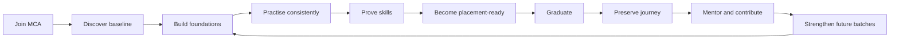
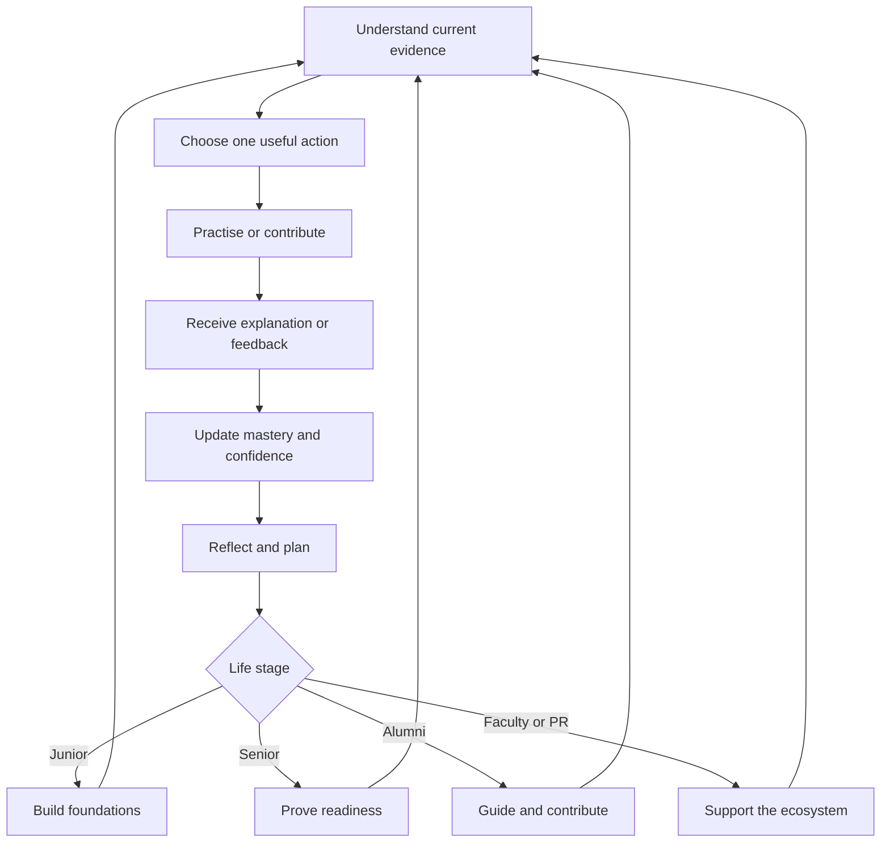

# PSGMX Companion Application — Complete Product and User Flow Specification

> Product blueprint for the PSG Tech MCA readiness companion across Flutter mobile, Next.js web, Placement Readiness Representative administration, faculty, HOD, alumni, and future batches.
>
> This is a flow specification, not a release report. It describes the continuous experience the product should provide, identifies current repository gaps, and defines the recommended destination.

## 1. The product promise

PSGMX is the MCA department's continuous readiness companion. It helps every student understand what to improve, practise the right thing, receive support, learn from earlier batches, demonstrate progress, and eventually return as an alumnus who strengthens the same system.

The product has no terminal “success” screen. Its lifecycle continues:

The emotional promise is equally important:

- A student should open PSGMX and immediately know, “What is the best useful action I can complete now?”
- A faculty member should immediately know, “Who needs help, why, and what is the next responsible intervention?”
- A Placement Readiness Representative should know, “Is the preparation programme running well, and what needs action today?”
- The HOD should know, “Is each batch becoming healthier without exposing or humiliating individuals?”
- An alumnus should know, “What small contribution from my experience will help a real junior this week?”

## 2. Locked product boundary: PSGMX and NEO PAT are different systems

PSGMX must not become a placement-drive management system. PSG Tech already uses NEO PAT for official placement operations.

### NEO PAT owns

- Official placement-drive creation and scheduling.
- Company registration and company visit administration.
- Eligibility, applications, shortlists, hall tickets, and official selection status.
- Package records and official placement outcomes.
- Any action that claims to represent the college placement office.

### PSGMX owns

- Readiness diagnosis and personalised preparation.
- Daily aptitude, coding, core-CS, communication, and interview practice.
- Mock assessments and evidence-backed improvement plans.
- Faculty mentorship and early intervention.
- Peer squads, practice sessions, and preparation accountability.
- LeetCode progress and coding consistency.
- Knowledge shared by seniors, faculty, and alumni.
- FYP progress, portfolio evidence, and explanation practice.
- Alumni lineage, mentoring, and reusable career knowledge.
- The student's preparation story before, during, and after the MCA programme.

### Required product changes

The current `Companies & Drives`, company CRUD, and drive-oriented Placement Log flows should not remain primary PSGMX features.

They should be replaced as follows:

- `Companies & Drives` becomes **Preparation Tracks**.
- `Placement Log` becomes **Interview Pattern Library**.
- Company-specific records become reusable, non-official patterns such as “multi-round coding interview,” “service-company aptitude pattern,” or “product-company DSA pattern.”
- Package bands, eligibility, and official visit dates are removed from the PSGMX authoring flow.
- A senior or alumnus may share a personal experience, but it must be presented as historical preparation insight, never as an official current drive.
- If an official drive is mentioned, PSGMX shows: “Open NEO PAT for official drive details.” PSGMX does not copy or maintain that data.

This boundary keeps PSGMX focused, trustworthy, and maintainable for the next five batches.

## 3. Experience principles

### 3.1 One useful next action

Dashboards must not be collections of unrelated cards. The first section always answers:

1. What should I do next?
2. Why does it matter to me?
3. How long will it take?
4. What progress will it create?

### 3.2 Progress must be explained

A score without an explanation creates anxiety. Every score must show the evidence, freshness, strongest dimension, most valuable next improvement, and realistic effect of the suggested action.

### 3.3 Mobile is the daily companion; web is the depth workspace

- Mobile is for today, short practice, check-ins, reminders, quick reflection, campus pulse, and progress.
- Web is for mock exams, long-form knowledge, AI research, FYP work, detailed analytics, moderation, and administration.
- A task started on one channel must be resumable on the other when the task type allows it.
- The user should never need to understand that two technology stacks exist.

### 3.4 Roles add capabilities; they do not replace identity

A Team Leader, Coordinator, or PR is still a student. Administrative capability appears as an additional workspace, not as a completely different personality or home experience.

### 3.5 Ethical engagement, not dark-pattern addiction

PSGMX should earn repeat use through visible growth and community responsibility. It must not use infinite feeds, fake urgency, shame, manipulative countdowns, or rewards for screen time.

### 3.6 Every state is designed

Every data-driven screen requires a meaningful loading state, first-use state, recoverable error, stale-data state, success state with a next action, and an offline state where safe cached content remains available.

## 4. Roles and access model

### 4.1 Student — active junior

The current junior cohort, such as `26MX`, is in the foundation stage. They receive more guided learning, calibration, exploration, and habit-building.

### 4.2 Student — active senior

The current senior cohort, such as `25MX`, is in the proof and interview-readiness stage. They receive more timed practice, mock interviews, portfolio proof, reflection, and contribution opportunities.

### 4.3 Team Leader

A student with delegated responsibility for a small preparation squad. They coordinate participation and encourage peers but do not become a disciplinary authority.

### 4.4 Coordinator

A student with selected operational permissions such as publishing practice tasks, scheduling preparation sessions, or posting announcements.

### 4.5 Placement Readiness Representative (PR)

The main student administrator for the preparation programme. In PSGMX, “PR” should mean **Placement Readiness Representative**, not placement-drive operator. The PR manages access, squads, preparation programming, participation, question content, communication, rollout, and audit visibility.

### 4.6 Faculty

A department mentor and academic reviewer. Faculty guide students, moderate shared knowledge, author assessments, review FYP progress, and intervene when evidence indicates that support is needed.

### 4.7 HOD and authorised governance administrator

The current HOD and any explicitly retained former HOD may have governance access. The implementation should separate:

- Display title: current HOD, former HOD, faculty.
- Security capability: `governance_admin`.

This is safer than labelling two people as the current HOD merely to grant the same access. Dr. Ilayaraja N can be the current HOD while Dr. Chitra A retains authorised governance access.

### 4.8 Alumni

A graduated student whose journey becomes an archive and whose new value comes from mentoring, reviewing, contributing knowledge, and creating continuity across batches.

### 4.9 System automation

Scheduled and event-driven processes handle identity aliasing, score recomputation, batch rotation, knowledge review reminders, notifications, data freshness, and lifecycle transitions.

## 5. Continuous lifecycle

### 5.1 Admission and pre-onboarding

1. The HOD or authorised PR creates or activates the intake batch.
2. The roster is imported with register number, name, personal email when available, and deterministic future college email.
3. The system validates duplicates by register number, personal email, and college email alias.
4. Each student has one logical identity even if they later switch from personal email to `rollnumber@psgtech.ac.in`.
5. The student receives a welcome message that explains PSGMX as a preparation companion, not a placement portal.

### 5.2 Junior foundation stage

The student establishes a baseline, builds a daily practice habit, connects coding identity, learns core concepts, and discovers the department's knowledge network.

### 5.3 Senior proof stage

The student moves from “learning topics” to “proving readiness” through timed practice, mock assessments, communication drills, FYP storytelling, and interview-pattern reflection.

### 5.4 Graduation transition

The batch does not disappear. The student's active preparation dashboard becomes a journey archive. Delegated permissions are removed, final evidence is preserved, and alumni onboarding begins.

### 5.5 Alumni continuity

The alumnus receives lightweight, relevant prompts: answer a junior's question, review one article, share one pattern, update a career milestone, or volunteer for a mentoring window.

### 5.6 Return loop

Alumni contributions improve the Knowledge Brain, AI Senior, preparation tracks, and mentorship for current students. Current students later graduate and continue the same loop.

## 6. Universal identity and authentication flow

### 6.1 Student OTP login — mobile and web

1. The user enters either an approved personal email or college email.
2. The client normalises case and whitespace.
3. The server resolves the email against direct roster fields and email aliases.
4. If the email matches the MCA college pattern, the register number is derived and attached to the existing roster identity when safe.
5. The server returns a generic response whether or not the address exists, preventing account discovery.
6. A six-digit OTP is sent to a real, active inbox.
7. The user enters the OTP.
8. The server verifies the code and resolves the authenticated account to one logical PSGMX profile.
9. Role, batch status, permissions, and onboarding state decide the destination.
10. The session persists securely until expiry or sign-out.

For students whose college inbox does not yet exist, the personal email remains the deliverable OTP address. The future college alias may be reserved, but PSGMX must never claim it sent mail to an inactive inbox.

### 6.2 Faculty and HOD OTP login

1. The faculty member enters the seeded department email.
2. PSGMX confirms the email belongs to the faculty roster and provisions a missing auth profile if required.
3. A normal OTP is sent and verified.
4. During controlled testing only, `098765` may be accepted for seeded faculty if the server-side `ALLOW_STATIC_OTP` flag is exactly enabled.
5. The static code must never work for students, alumni, unknown faculty emails, or production when the flag is off.
6. Faculty route to the faculty workspace. Users with governance capability also see governance sections.

### 6.3 Alumni first-time join

1. The alumnus selects **Join alumni network**.
2. They enter full name, MCA register number, email, and optional LinkedIn URL.
3. The UI derives and displays the intake batch before submission.
4. The server confirms that the register number belongs to a graduated batch.
5. Existing identities are reused; a register number or email linked to another person is rejected.
6. The alumni profile and whitelist identity are created or updated.
7. OTP is sent to the verified email.
8. Successful verification opens a short alumni re-entry story, not a generic dashboard.
9. The alumnus chooses contribution interests and whether they are open to mentoring.

### 6.4 Returning alumni login

Returning alumni use the normal OTP flow. Their personal and college aliases resolve to the same profile. If an email changed, a faculty/HOD identity-recovery workflow adds the new alias after verification rather than creating a second account.

### 6.5 Authentication recovery states

- **Unknown email:** show the generic send-code response, then provide “Need access help?” without revealing roster status.
- **Expired OTP:** preserve the email, clear only the code, and offer resend after the cooldown.
- **Too many attempts:** show the exact safe retry time and support route.
- **Missing profile after valid auth:** hold the session in an account-recovery screen; do not redirect in a loop.
- **Duplicate identity:** block automatic merging and create a governance review case.
- **Inactive future college inbox:** explain that the personal email should be used until college mail activation.
- **Wrong batch or name:** allow a correction request; do not let the student edit the register number directly.
- **Offline:** do not attempt OTP; explain that a connection is required only for sign-in.

## 7. First-session onboarding flow

### 7.1 Story

The opening story should communicate in under one minute that PSGMX learns from previous MX batches, gives a useful daily action, explains progress, and is separate from official NEO PAT drives. It may be skipped and should not replay unless opened from Help.

### 7.2 Identity confirmation

Show name, register number, detected batch, junior/senior stage, and login email. The user can confirm or request correction. They cannot silently change protected identity fields.

### 7.3 Preparation calibration

Replace a tiny generic calibration with a transparent baseline flow:

- Goals and target role families, not company names.
- Confidence across aptitude, coding, core CS, communication, and portfolio.
- A short adaptive diagnostic sample.
- Available weekly practice time and preferred reminder windows.
- Connect LeetCode now or choose “do this later.”

Self-reported confidence personalises the starting plan but does not directly inflate evidence-backed readiness.

### 7.4 Outcome reveal

Show a low-confidence starting plan, one strength, one foundation area, and a seven-day journey. Explain that recommendations become more accurate as verified evidence accumulates.

### 7.5 First meaningful success

Immediately offer one five-minute starter mission. Completion creates the first XP, starts the weekly journey, and opens Today. Onboarding must not end at an empty dashboard.

## 8. Channel architecture

### 8.1 Recommended mobile navigation

Keep no more than five persistent destinations:

1. **Today** — one prioritised plan, deadlines, announcements, and resume state.
2. **Train** — Daily Five, adaptive practice, LeetCode, communication drills, and mock preparation.
3. **Progress** — readiness dimensions, mastery map, evidence, streak, and personal bests.
4. **Community** — lineage, Knowledge Brain, squads, mentoring, and approved announcements.
5. **You** — profile, connected identities, preferences, help, and journey archive.

Administrative students receive an Admin switch or shortcut inside You and Today. Mobile offers urgent quick actions; full administration remains on web.

### 8.2 Recommended web navigation for students

- **Overview** — current plan and cross-channel resume.
- **Prepare** — assessments, practice tracks, AI Senior, and Interview Pattern Library.
- **Build** — FYP, portfolio evidence, and project storytelling.
- **Learn Together** — Knowledge Brain, lineage, squads, and mentoring.
- **Progress** — readiness detail, history, evidence, and recovery plan.
- **Inbox** — actionable announcements and notifications.
- **Account** — identity, preferences, privacy, connected services, and support.

### 8.3 Cross-channel handoff

- A mobile card opens a web-only mock exam through a secure deep link.
- A web AI Senior conversation can be resumed on mobile.
- Saved Knowledge Brain content is available on both channels.
- FYP updates may start on mobile as a quick note and finish on web.
- Notification deep links resolve to an authenticated destination and safe fallback.
- Progress uses the shared database; the user never manually “syncs apps.”

## 9. Student flow — Today

### 9.1 Entry priority

1. Safety or account issue requiring action.
2. Assessment or practice session starting soon.
3. In-progress action that can be resumed.
4. Personal best-next mission based on the weakest fresh readiness dimension.
5. Daily habit such as Daily Five.
6. Important batch announcement.
7. Optional discovery or community content.

Only one item is styled as the primary action.

### 9.2 Today story

The page reads as opening, tension, action, reward, and continuity. Example: “Your coding consistency is improving. Core CS evidence is 18 days old. Complete a seven-minute DBMS sprint to refresh it and finish two of three weekly missions.”

### 9.3 Completion

1. Show what was learned or verified.
2. Update XP and mission state immediately.
3. Mark score updates as recalculating until confirmed.
4. Suggest either a short next action or a healthy stopping point.
5. Never force another action to protect a streak.

### 9.4 Return later

If the student leaves midway, Today shows Resume with progress and remaining time. A partial quiz is restored only if assessment integrity permits it.

## 10. Student flow — Train

### 10.1 Daily Five

1. Student sees topic mix, estimated time, current streak, and available freeze.
2. The system chooses five questions using mastery gaps, recent repetition, difficulty, and curriculum coverage.
3. Each answer is captured locally and safely submitted once.
4. Explanations appear after submission, not during an active attempt.
5. Results show accuracy by skill, one misconception, and a follow-up.
6. Streak and XP update from the server.
7. Reopening the same explanation earns no extra XP.

Adaptation rules:

- Do not quickly repeat a correctly mastered item.
- Revisit a misconception with a different question after spaced delay.
- Keep at least one confidence-building item in each set.
- Avoid one-topic sets unless the student starts a focused sprint.
- Report and review ambiguous questions.

### 10.2 Adaptive skill sprint

1. Student chooses the recommended sprint or a domain.
2. They select 5, 10, or 20 minutes.
3. Content adapts from quick recall to application.
4. The end shows mastery movement and evidence confidence.
5. Incorrect concepts enter a revisit queue.

### 10.3 LeetCode

1. Student enters a username, never a password.
2. PSGMX validates format, checks duplicate ownership, and links it to the logical profile.
3. Stats refresh in the background and show last verification time.
4. The app recommends patterns or consistency goals without copying LeetCode content.
5. Personal trend is primary; cohort percentile is secondary and requires fresh, sufficient data.
6. Username changes are rate-limited and audited.

For `26MX`, personal and deterministic college email both resolve to one account while LeetCode remains attached to the register-number identity.

### 10.4 Communication and interview practice

This missing pillar should include self-introduction rehearsal, FYP explanation, STAR story building, group-discussion practice, peer/alumni mock requests, and structured reflection. AI scores are coaching signals, not truth; human-reviewed evidence receives higher confidence.

### 10.5 Mock assessment

1. Faculty publishes target batch, availability, duration, topics, and integrity level.
2. Student sees preparation guidance.
3. Server records start time and attempt state.
4. Questions load through answer-safe endpoints.
5. Allowed interruptions preserve progress.
6. Submission is idempotent.
7. Results explain domain performance and link to remediation.
8. Student records a short reflection.
9. Faculty sees patterns and integrity flags, not only rank.

## 11. Student flow — Progress and readiness

### 11.1 Current limitation

The current score uses Daily Five, LeetCode, mock exams, and preparation-session attendance. It is understandable but too narrow. Presence does not equal capability, and communication, core CS depth, portfolio proof, freshness, and confidence are underrepresented.

### 11.2 Readiness Engine v2

Use six evidence dimensions totalling 100:

- **Aptitude and reasoning — 15:** adaptive practice and verified mocks.
- **Coding and problem solving — 20:** LeetCode trend, coding assessments, and pattern mastery.
- **Core computer science — 15:** DBMS, OS, networks, OOP, programming, and systems.
- **Communication and interview expression — 15:** structured practice, human feedback, and mocks.
- **Assessment performance — 20:** fresh, normalised results across domains.
- **Portfolio and project proof — 15:** FYP milestones, repository quality, demos, and explanation readiness.

Consistency modifies evidence confidence rather than rewarding raw app use. Session participation supports a dimension but does not independently imply readiness.

### 11.3 Every dimension displays

- Current score and band.
- Confidence: low, medium, or high.
- Last meaningful evidence date.
- Trend over 30 and 90 days.
- Contributing evidence.
- Single most valuable next action.
- “Why this changed” history.

### 11.4 Fairness

- Missing evidence is “not yet measured,” not failure.
- Old evidence loses confidence before score.
- Self-reported activity cannot create verified mastery.
- Corrections require reason and audit.
- Students can dispute a record.
- Readiness is private by default.
- PSGMX readiness alone must not decide hiring or official eligibility.

### 11.5 Recovery plan

Explain the weak/stale evidence, offer a small mission, provide a realistic window, connect support if difficulty repeats, and celebrate recovery from the student's own baseline.

## 12. Student flow — Campus and academics

1. Student securely configures eCampus access if required.
2. The app displays attendance, CA marks, timetable, CGPA, and risk with last sync time.
3. Credentials remain encrypted server-side and are never read back into the client model.
4. Failure shows stale cached results and explicit refresh.
5. Academic risk gently adjusts Today priorities.
6. PSGMX must not gamify low attendance or encourage “safe bunking.”
7. Faculty access follows department policy and RLS.

## 13. Knowledge Brain, AI Senior, and pattern learning

### 13.1 Knowledge discovery

1. Search by skill, role family, pattern, FYP area, or question.
2. Results identify source type, author role, batch, approval, and freshness.
3. Save, mark useful, or report outdated information.
4. Reading ends with retrieval check, related practice, or Ask AI Senior.
5. Knowledge credit requires meaningful retrieval, not page views.

### 13.2 AI Senior

1. Student asks a preparation question.
2. The system retrieves approved department knowledge.
3. The answer separates source-backed guidance from general reasoning.
4. Citations open exact sources.
5. Weak evidence is disclosed with faculty/alumni escalation.
6. The answer can become a saved practice plan.
7. Sensitive student data is not exposed.
8. Official-drive questions route to NEO PAT.

### 13.3 Interview Pattern Library

This replaces the company-centric Placement Log.

1. A senior/alumnus selects aptitude screening, coding round, technical deep dive, FYP discussion, HR conversation, or group discussion.
2. They describe helpful preparation, mistakes, themes, and advice.
3. Company naming is optional historical context, not the structure.
4. Faculty reviews privacy, accuracy, relevance, and expiry.
5. Approved insight becomes searchable and may ground AI Senior.
6. Old content enters re-review instead of remaining permanently trusted.

## 14. FYP and portfolio proof

1. Student creates title, problem, domain, team, guide, repository, and outcome.
2. The system proposes stage-appropriate milestones.
3. Student logs updates and evidence links.
4. Faculty comments, requests changes, or confirms a milestone.
5. PSGMX tracks ability to explain problem, architecture, trade-offs, contribution, testing, result, and future work.
6. AI suggests questions but cannot fabricate implementation evidence.
7. Finished FYP becomes a portfolio story and, with permission, a junior example.
8. Graduation preserves it in the journey archive.

## 15. Lineage, squads, and mentoring

### 15.1 Lineage

1. Register suffix creates a starting relationship across batches.
2. Students see alumni only when privacy and mentoring settings permit it.
3. Profiles explain the match and available topics.
4. Requests include topic, context, and preferred response type.
5. Alumni accept, decline, or answer asynchronously.
6. Boundaries, reporting, and expectations are visible.

Add opt-in topic matching because suffix-only lineage is too narrow when a match is unavailable or irrelevant.

### 15.2 Preparation squads

1. PR creates balanced squads or previews rule-based distribution.
2. Each squad has one small weekly objective.
3. Leaders see participation, not private score details.
4. Students ask for help and share explanations.
5. Squad competition uses improvement/completion bands, not raw ability.
6. Students can report pressure or request a change.

## 16. Junior-batch journey

### First four weeks

- Complete identity and baseline.
- Connect LeetCode if available.
- Learn readiness evidence.
- Finish a seven-day starter journey.
- Join a preparation squad.
- Discover one lineage connection.
- Save the first Knowledge Brain resource.

### Foundation loop

- Daily: one five-to-ten-minute mission.
- Weekly: coding pattern, core-CS concept, aptitude checkpoint, and reflection.
- Monthly: low-stakes diagnostic and faculty pulse.
- Semester: evidence review, goal reset, and portfolio checkpoint.

### Promotion to senior

Show foundation growth and gaps, preserve achievements, introduce proof stage, shift to role-family tracks/timed practice, and invite one useful contribution to the incoming batch.

## 17. Senior-batch journey

Senior Today emphasises timed assessment, communication, project explanation, evidence freshness, interview-pattern practice, portfolio proof, and giving back.

The weekly loop includes an adaptive sprint, timed checkpoint, interview response, FYP improvement, pattern review, and reflection.

PSGMX must not show official eligibility, applications, shortlists, packages, active drive management, or an Apply action. Those belong in NEO PAT.

## 18. Team Leader flow

### 18.1 Activation

1. PR grants selected capabilities.
2. The student sees responsibility and privacy limits.
3. They accept the assignment.
4. Admin tools appear without removing their student companion.

### 18.2 Practice-session participation

1. Open an upcoming/recent preparation session.
2. See only assigned squad members.
3. Mark present, absent, excused, or remote where applicable.
4. Avoid sensitive medical details in notes.
5. Correct within a defined window.
6. Audit actor, time, old value, and reason.
7. Students can view and dispute their own record.

### 18.3 Quest support and exit

Leaders may see acknowledgement of a shared mission but not answers or readiness details. Their action is offer help, not punishment. Revoking capability preserves audit history and leaves the student's personal journey unchanged.

## 19. Coordinator flow

Coordinator access is capability-based.

### 19.1 Schedule preparation session

1. Choose coding lab, aptitude sprint, core-CS clinic, mock interview, group discussion, FYP review, or alumni talk.
2. Select batch/squads.
3. Set date, duration, location/link, capacity, and facilitator.
4. Add expected preparation and outcome.
5. Preview recipients and conflicts.
6. Publish with deep-link notification.
7. Capture participation and quality pulse afterward.

### 19.2 Publish quest

Choose template or create, define skill/difficulty/time/evidence/audience/window, preview mobile/accessibility, publish, monitor aggregate completion, then improve or retire based on feedback.

### 19.3 Announcements

Require audience, priority, expiry, action link, and owner. Priority is rare; expired items leave the active inbox but remain auditable.

## 20. Placement Readiness Representative admin flow

The PR web panel runs the preparation programme while respecting faculty/HOD boundaries.

### 20.1 Command Center

Show roster issues, unclosed participation, unusually low quest completion, stale question domains, correction requests, upcoming preparation, privacy-safe readiness movement, rollout health, and system warnings.

### 20.2 Members and access

1. Import CSV or add one roster member.
2. Validate register number, name, batch, personal email, and derived college email.
3. Preview creates, updates, duplicates, and rejects.
4. Commit idempotently.
5. Show one identity with all accepted aliases.
6. Separate role label from capabilities.
7. Grant least privilege through presets/custom selection.
8. Confirm member-management delegation.
9. Audit every change.
10. Recover identity without exposing OTPs.

PR must not create faculty/HOD governance access.

### 20.3 Cohorts and squads

PR views onboarding and identity health; lifecycle overrides require governance. Squad management previews size/balancing, avoids public score labels, assigns leaders, audits moves, and preserves history.

### 20.4 Preparation programme calendar

This replaces drive administration. It coordinates practice sessions, assessments, clinics, alumni interactions, and FYP checkpoints with conflict and audience validation.

### 20.5 Participation

PR sees session/squad status, closes/reopens correction windows, and resolves disputes. Participation is not treated as employability.

### 20.6 Quest Studio

Create, duplicate, schedule, pause, and retire quests. Each needs objective, domain, difficulty, duration, evidence, review material, audience, window, owner, and review date.

### 20.7 Question Bank

Add/import, validate answer/explanation/topic/difficulty/source, detect duplicates, review reported ambiguity, monitor quality, and retire safely without deleting history.

### 20.8 Communication Center

Publish targeted announcements with priority, expiry, and delivery/read state. Never publish private readiness details.

### 20.9 Readiness Pulse

Show aggregate movement, evidence coverage, practice engagement, and programme gaps. Sensitive component-level intervention belongs to faculty.

### 20.10 Content moderation

PR may triage pattern submissions if granted moderation; faculty retains final knowledge approval.

### 20.11 Reports and audit

Export preparation health: roster/access, participation, quest completion, evidence freshness, question quality, aggregate readiness, and permission audit. Exclude official drive, package, application, and outcome records.

### 20.12 Staged rollout

Select cohort/percentage, run identity/team/content/session/app checks, preview users, enable a small group, monitor errors and support, pause/rollback safely, then expand on health thresholds.

### 20.13 PR mobile quick actions

Mobile may show today's session status, quick attendance correction, approved announcement templates, urgent support, and pause quest. Imports, permissions, authoring, analytics, and rollout remain web-first.

## 21. Faculty flow

### 21.1 Dashboard

Show mentees awaiting response, recovery cases, knowledge review, FYP feedback, assessment work, batch misconceptions, and progress worth acknowledging.

### 21.2 Student explorer

Filter by batch/squad/dimension/freshness/support; search identity; open consent-appropriate timeline; review evidence, assessment, participation, FYP, and interventions; then start a note, recovery mission, or check-in. Private faculty notes stay private.

### 21.3 Recovery Hub

1. Evidence gaps, repeated difficulty, academic risk, or a student request suggests a case.
2. Faculty reviews context; automation does not label a student alone.
3. Faculty sets goal, actions, owner, review date, and privacy.
4. Student sees support, not punishment.
5. Review on date.
6. Close with outcome and maintenance action.
7. Preserve private continuity history.

### 21.4 Mentorship

Requests include topic/outcome. Faculty accepts asynchronously, schedules, or redirects. Both record one next step; the system follows up once without spam. Verified evidence is created only when appropriate.

### 21.5 Mock Assessment Studio

1. Build from a domain/difficulty blueprint.
2. Select reviewed questions.
3. Configure window, duration, attempts, batch, integrity, accommodations, and feedback release.
4. Preview as student.
5. Publish and monitor.
6. Analyse misconceptions and coverage.
7. Publish remediation tracks.
8. Retire while preserving history.

This must become first-class faculty navigation.

### 21.6 Knowledge moderation

Sort by risk/age/impact; inspect source, claims, privacy, duplicates, and AI checks; approve/request changes/reject/set expiry; embed after approval; re-review material edits; remove outdated content from AI grounding.

### 21.7 FYP Repository

Browse live projects by batch/domain/guide/stage/support, review evidence/logs, give structured feedback, confirm milestones, use examples only with permission, and aggregate topics without exposing private repositories.

### 21.8 AI Senior Insights and analytics

Show aggregate demand, unanswered topics, citation gaps, reports, stale evidence, questionable items, and programme effectiveness. Do not expose identifiable private conversations without policy and escalation. Every metric needs an owner or action.

### 21.9 Announcements and settings

Publish guidance with audience, expiry, and action. Remove password forms while OTP is the principal authentication method unless password auth is deliberately implemented.

## 22. HOD and governance flow

### 22.1 Governance entry and health

Capability-gated faculty navigation shows active/upcoming batches, identity/onboarding coverage, readiness evidence coverage, knowledge/FYP review health, privacy-safe recovery state, system errors, cron health, and stale integrations.

### 22.2 Batch management

Create/prepare future batch, set lifecycle dates, preview roster/aliases, activate onboarding, preview promotion/graduation, approve exceptional override with reason, and preserve history. Standard transitions are automatic and idempotent.

### 22.3 Faculty management

View seeded roster/auth state, provision approved email, separate title from security, grant/revoke governance with confirmation, preserve audit when roles change, and disable access without deleting authored work.

### 22.4 Identity review

Governance handles duplicate identities, changed emails, disputed register numbers, and unusual alumni claims using minimum data and recorded decisions.

### 22.5 System governance

Review audit, rollout, scheduled jobs, knowledge indexes, freshness, and privacy-safe summaries. Impersonation requires reason, visible banner, expiry, and full audit.

## 23. Alumni flow

### 23.1 Re-entry and home

After OTP, show preserved batch journey, one career-profile request, interests, mentoring boundaries, and one small contribution. Home prioritises accepted requests, drafts, stale knowledge updates, lineage milestones, announcements, then memories.

### 23.2 Journey archive

Show final evidence, healthy streak, assessments, FYP, contributions, milestones, and batch memories. Career milestones may be added; verified history cannot be rewritten.

### 23.3 Contribute knowledge

1. Choose interview pattern, technical guide, career transition, FYP lesson, communication advice, or mentoring resource.
2. Use a guided outline.
3. Autosave drafts.
4. Add historical context and accuracy date.
5. Preview privacy/attribution.
6. Submit for review.
7. Address changes and resubmit.
8. See impact through useful reads, saves, and resolved questions.

Replace current static submissions/articles with this live lifecycle.

### 23.4 Mentorship

Opt in by topic/mode/frequency/availability; receive contextual requests; accept/decline/redirect/pause; communicate within boundaries; record resolution; automatically pause new requests after repeated non-response without public penalty.

### 23.5 Community Board

Convert Marketplace into a moderated board for project collaboration, open source, mentoring circles, learning events, career-information sessions, and clearly unofficial opportunities/referrals where policy permits. It must not imitate NEO PAT.

### 23.6 Alumni lineage

Show permitted junior context and issue specific contribution prompts based on real demand rather than generic “give back” banners.

## 24. Gamification and motivation engine

### 24.1 XP

XP represents preparation evidence, not app use. Reward Daily Five, adaptive sprints, assessments, recovery after error, validated FYP evidence, accepted peer help, and approved knowledge. Do not reward opening, scrolling, refreshing, or duplicate content.

### 24.2 Mastery

Skills progress through Discovering, Practising, Applying, Demonstrating, and Maintaining. Different levels require different evidence; repetition alone cannot reach Demonstrating.

### 24.3 Streaks

- Prefer weekly consistency over punishing daily streaks.
- Give two grace/freeze days monthly.
- Support planned pause.
- Broken streaks retain mastery and lifetime progress.
- Never send late-night shame.
- Celebrate return streaks.

### 24.4 Weekly journeys and seasons

Give three to five balanced missions: easy start, skill depth, and long-goal connection. Use academic seasons: Foundation, Core Mastery, Build/Portfolio, Interview Readiness, and Transition/Contribution.

### 24.5 Social motivation

Show personal best first, use opt-in squad goals, rank by improvement only with fresh/sufficient cohorts, never expose bottom performers, separate junior/senior rankings, and allow leaderboard opt-out.

### 24.6 Evidence badges

Examples: foundation finisher, DBMS misconception clearer, assessment reflection, FYP explanation ready, lineage helper, approved article, and returned after a break. Avoid badges for taps/logins.

### 24.7 Anti-gaming

Use server-authoritative timestamps, idempotent submissions, rotation/anomaly detection, no duplicate reward, human review for high-impact contributions, transparent corrections, and no secret penalties.

## 25. Notification and inbox flow

Classes are action required, scheduled reminder, progress, community, announcement, and system.

Delivery respects category preferences and quiet hours, bundles low priority, deep-links exactly, synchronises read state, explains why it was sent, expires obsolete actions, and hides private score detail from lock screens.

The weekly digest tells what was completed, which skill moved, what evidence is stale, one next focus, and one community resource.

## 26. Offline, failure, and support

### 26.1 Mobile offline

Show last sync, read cached approved resources/progress, queue safe drafts, and reconcile idempotently. Do not blindly queue OTP, final exam submission, attendance authority changes, or permissions.

### 26.2 Loading failure and empty state

Keep successful modules usable and retry the failed module. Empty states explain why and who can create the first item. No assessment offers a preparation track; no mentor offers topic matching; no FYP starts setup; no announcement means up to date.

### 26.3 Support

User selects access, incorrect data, content, assessment, privacy, or technical issue; previews attached context; receives a case number; PR handles operations, faculty handles academic/content, HOD handles governance; resolution is in-app and auditable.

## 27. Mobile visual and interaction standard

- Design at 360 px first.
- Use 44–48 px tap targets.
- One dominant action per screen.
- Keep navigation labels visible.
- Preserve form input and use appropriate keyboards.
- Convert admin tables to cards/detail views on small screens.
- Match skeletons to final layout.
- Support text scaling, screen readers, contrast, and reduced motion.
- Motion confirms continuity without delay.
- Share spacing, radius, typography, colour semantics, and status language across Flutter and Next.js.
- Premium means calm hierarchy and trustworthy feedback, not excessive effects.

## 28. Current repository problems and required corrections

This section is grounded in current Flutter routes, web role layouts, services, and database flows.

### 28.1 Mobile label/destination mismatch

The senior-only bottom item says `Sessions` but opens `PlacementLogScreen`. Replace it with the new Train/Pattern flow or label it accurately during migration.

### 28.2 Broken Daily Five deep link

Mobile Home pushes `/spark-five`, but the router defines `/daily-five`. Use one named route and navigation tests.

### 28.3 Duplicated Home and Today

Consolidate into one authoritative Today composition to prevent divergent data, copy, and navigation.

### 28.4 Duplicated graduation screens

Use one lifecycle route and one persisted acknowledgement.

### 28.5 Unsafe company-detail deep link

The route expects a full Company object in extra state, which cold links may lack. Routes must load by stable ID with not-found/retry states.

### 28.6 NEO PAT overlap

PR Companies, company Placement Log, company prompts, package records, and visit records must migrate to Preparation Tracks and Interview Pattern Library.

### 28.7 Narrow readiness

Adopt v2 dimensions, confidence, and freshness; participation alone is not capability.

### 28.8 Static faculty and alumni shells

Static arrays remain in faculty Knowledge Brain, Mentorship, Recovery Hub, FYP presentation data, alumni Contribute, and alumni Knowledge Brain. Implement live loading, empty, error, mutation, and review states before calling these functional.

### 28.9 Passwordless/settings conflict

Faculty and alumni settings show password fields while login is OTP. Remove them or deliberately implement password authentication.

### 28.10 Incomplete inbox

Some notification bells only route to announcements. Build a unified actionable inbox with read state, category, expiry, and deep link.

### 28.11 Mixed role labels and capability flags

Make capabilities authoritative and apply identical guards in mobile, web, APIs, RPCs, and RLS. Labels are presentational.

### 28.12 Team scope must be database-enforced

Team Leader scope cannot rely on service convention. Enforce sensitive scope in RLS/RPC.

### 28.13 Rollout needs real health

Add telemetry thresholds, affected-user preview, rollback, and audit—not only static stages.

### 28.14 Generic dashboard density

Recompose cards around next action, progress story, and role queue.

### 28.15 Analytics without decisions

Remove or demote metrics with no owner, threshold, or action.

### 28.16 Broad alumni asks

Replace generic Contribute/Marketplace calls with specific, time-bounded prompts tied to student demand.

### 28.17 Suffix-only lineage

Keep the tradition but add topic-based opt-in matching and availability.

## 29. System and automation flows

### 29.1 Identity alias sync

Validate and synchronise personal, college, and canonical aliases. Conflicts become review cases, never silent overwrites.

### 29.2 Readiness recomputation

Meaningful evidence triggers idempotent recomputation with dimension history, algorithm version, and freshness. Failures retry and alert system health.

### 29.3 LeetCode refresh

Refresh linked users within rate limits, detect anomalies, store last success/error, and never lower verified history because of temporary upstream failure.

### 29.4 Knowledge lifecycle

Submission → review → approval → embedding → searchable → cited → feedback → scheduled re-review → revision/retirement.

### 29.5 Batch lifecycle

Prepared → pending onboarding → active junior → active senior → graduated. Yearly transition previews changes, runs idempotently, clears student-admin capability, preserves history, and opens the relevant chapter.

### 29.6 Community health

Scheduled checks identify unanswered mentoring, stale content, support cases, and programme gaps. Automation suggests; humans decide sensitive outcomes.

### 29.7 App version and rollout

Check minimum, recommended, and emergency-block versions. Optional updates do not block; forced updates explain why and preserve safe drafts.

## 30. Product analytics and success measures

The objective is regular useful behaviour, not maximum time.

### 30.1 North star

**Weekly Prepared Students:** percentage of active students completing at least two meaningful preparation actions in different readiness dimensions during a week.

### 30.2 Supporting measures

- First useful action within 24 hours.
- Four-week retained preparation habit.
- Fresh evidence in at least four dimensions.
- Recovery completion/return.
- Assessment reflection completion.
- Knowledge questions resolved with approved sources.
- Alumni requests answered within availability.
- FYP milestones with evidence.
- Support resolution time.
- OTP success and duplicate-identity rate.
- Crash-free sessions and failed deep links.

### 30.3 Guardrails

- Notification opt-out/complaints.
- Late-night use from streak pressure.
- Leaderboard opt-out.
- Disputed scores/attendance.
- AI answers with weak citations.
- Faculty workload per case.
- Alumni request overload.

### 30.4 Event model

Events include stable user, role, batch, channel, flow, object, result, duration, version, and correlation ID. Never log answer content, OTPs, passwords, or private notes.

Track OTP stages, onboarding, mission lifecycle, assessment/recovery/reflection, readiness/explanation, knowledge search/use, mentoring lifecycle, permission/import/rollout/correction actions.

## 31. Implementation sequence

### Phase 1 — Trust and focus

1. Remove Companies & Drives from primary navigation.
2. Replace Placement Log with Interview Pattern Library.
3. Fix `/spark-five` and `/daily-five`.
4. Consolidate Home/Today and graduation.
5. Correct labels and ID-based deep links.
6. Remove misleading password settings.
7. Align capability guards through clients, APIs, RPCs, and RLS.

### Phase 2 — Daily companion

1. Build prioritised Today.
2. Add cross-channel resume.
3. Add adaptive sprints and revisit queue.
4. Build unified inbox.
5. Add weekly journeys, ethical streaks, XP, and mastery.

### Phase 3 — Complete readiness

1. Introduce versioned Readiness v2 with confidence.
2. Add communication/interview practice.
3. Turn FYP into portfolio evidence.
4. Add Mock Assessment Studio and live Recovery Hub.

### Phase 4 — Community continuity

1. Complete live alumni drafts/review.
2. Add structured mentoring and topic matching.
3. Convert Marketplace to Community Board.
4. Add contribution impact and knowledge re-review.

### Phase 5 — Scalable governance

1. Separate title from governance capability.
2. Complete lifecycle previews/exceptions.
3. Add rollout health/rollback/audit.
4. Add privacy-safe five-batch analytics.

## 32. Definition of complete by role

### Student

Authenticate with either valid identity, understand stage, complete a useful action, see explained progress, recover from gaps, practise all dimensions, ask for help, build evidence, and continue across channels.

### Team Leader and Coordinator

Perform only assigned preparation operations within scope, with correction and audit, while retaining the student experience.

### PR

Run roster access, squads, sessions, quests, participation, question bank, communication, readiness pulse, support, reports, audit, and rollout without official drive management.

### Faculty

Identify support needs, mentor, author/analyse assessments, moderate live knowledge, review FYP evidence, and close recovery loops with current data.

### HOD/governance

Safely manage batches, faculty access, identity exceptions, health, lifecycle, and privacy-safe outcomes with auditability.

### Alumni

Join by OTP, preserve journey, update context, contribute reviewed knowledge, mentor within boundaries, and remain useful without student placement features.

## 33. The never-ending companion loop

There is no end of PSGMX. The relationship changes from learner to practitioner, contributor, mentor, and steward.

## Appendix A — Current mobile route disposition

This map prevents existing Flutter routes and screens from being lost during the companion redesign.

- `/splash`: keep as a short bootstrap that resolves auth, profile, app-version, offline, and lifecycle state. It must never become a long branded delay.
- `/onboarding`: rewrite copy around readiness companionship and the NEO PAT boundary; show only before first login or from Help.
- `/login`: keep approved personal/college email plus OTP and full recovery states.
- `/batch-confirmation`: keep as protected identity confirmation, with correction request rather than editable register number.
- `/calibration`: expand into the transparent baseline defined in Section 7.
- `/outcome`: convert from score theatre into a low-confidence starting plan and first mission.
- `/`: replace overlapping Home/Today compositions with the single Today destination.
- `/notifications`: keep and upgrade into the unified actionable Inbox.
- `/settings`: keep under You; align every control with actual backend persistence and OTP authentication.
- `/daily-five`: keep as the canonical route. Remove every `/spark-five` reference.
- `/placement-log`: migrate to `/interview-patterns` and remove official drive/company structure.
- `/placement-log/company/:id`: retire. New pattern detail routes load by stable pattern ID rather than router extra state.
- `/ai-mentor`: rename consistently to AI Senior or choose one product name; keep source-grounded preparation flow.
- `/pulse-rankings`: move under Progress; make comparison opt-in, stage-aware, improvement-based, and privacy-safe.
- `/leetcode-arena`: keep under Train/Progress with personal trend first.
- `/credits`: keep under About inside You; it is not a primary journey.
- `/help-support`: keep and add trackable support cases.
- `/proctored-exam`: keep only if the assessment rules can be enforced on the device; otherwise deep-link to the web exam with explanation.
- `/graduation`: keep one canonical graduation transition and delete/merge duplicate presentation logic.

The repository also contains mobile admin screens for command centre, team management, scheduling, question bank, and member permissions that are not present in the active router. Choose one of two explicit outcomes for each:

1. Add a capability-gated Admin route and use it only for the PR quick actions in Section 20.13.
2. Remove the orphaned screen after confirming the web console covers the operation.

Do not leave invisible, untested admin code that appears functional in the repository but cannot be reached safely by a user.

## Appendix B — Current web route disposition

### Public and authentication

- `/`: keep as the clear public explanation of PSGMX readiness companionship.
- `/login`: keep as the shared OTP entry and role router.
- `/join-alumni`: keep as graduated-batch enrolment plus OTP.
- `/onboarding` and `/onboarding/first-login`: consolidate role-aware first-session logic and prevent loops.
- `/change-password`: retire while OTP-only authentication is authoritative, or deliberately enable and document password auth.
- `/download`: keep as a trusted mobile download/install page with version and integrity information.
- `/app`: keep only if it has a deliberate handoff purpose; avoid a second generic landing page.
- `/exam/[examId]`: keep as the canonical deep web assessment route with secure resume and submission.
- `/knowledge/search`: merge with the role-aware Knowledge Brain search unless a public/global search use case is intentional.
- `/hod`: redirect to the capability-gated faculty governance workspace; do not maintain a second HOD portal.

### Student workspace

- `/student`: becomes Overview with the same next action and resume state as mobile Today.
- `/student/ai-senior`: keep under Prepare and ground every answer in approved sources.
- `/student/knowledge-brain`: keep under Learn Together.
- `/student/exams`: keep under Prepare with upcoming, in-progress, completed, and remediation states.
- `/student/readiness`: keep under Progress and migrate to Readiness Engine v2.
- `/student/lineage`: keep under Learn Together and add topic-based matching.
- `/student/fyp`: keep under Build and expand to portfolio evidence.
- `/student/placement-log`: transform into Interview Pattern Library.
- `/student/announcements`: merge into the unified Inbox while retaining an announcement filter.
- `/student/recovery-hub`: surface the active recovery plan inside Progress and Today; retain a detail route for history.
- `/student/settings`: keep under Account with identity aliases, connected services, privacy, notifications, and support.

### PR workspace

- `/placement-rep`: keep as preparation Command Center.
- `/placement-rep/members`: keep as Members & Access with import preview, identity aliasing, least privilege, and audit.
- `/placement-rep/teams`: rename to Preparation Squads and preserve scoped history.
- `/placement-rep/sessions`: keep as Preparation Programme Calendar.
- `/placement-rep/attendance`: rename to Participation and add dispute/correction windows.
- `/placement-rep/tasks`: rename to Quest Studio.
- `/placement-rep/companies`: remove company/drive CRUD and replace the route with Preparation Tracks, or redirect to the new route during migration.
- `/placement-rep/announcements`: keep as Communication Center.
- `/placement-rep/questions`: keep as reviewed Question Bank.
- `/placement-rep/reports`: keep as Preparation Health & Audit, excluding official placement outcomes.
- `/placement-rep/rollout`: keep and add live readiness checks, thresholds, rollback, and impact preview.

### Faculty workspace

- `/faculty`: keep as the role-specific action queue.
- `/faculty/ai-insights`: keep for aggregate demand, citation gaps, and safety/quality review.
- `/faculty/knowledge-brain`: replace static presentation data with the live moderation lifecycle.
- `/faculty/fyp-repository`: complete the live repository, feedback, milestone, and evidence flow.
- `/faculty/recovery-hub`: replace static cases with real suggested/active/reviewed/closed cases.
- `/faculty/students`: keep as Student Explorer with evidence timelines.
- `/faculty/mentorship`: replace static mentees with live assignments, requests, next steps, and follow-up.
- `/faculty/analytics`: keep only decision-oriented analytics.
- `/faculty/announcements`: keep as faculty communication with audience and expiry.
- `/faculty/settings`: keep profile, preferences, privacy, and notifications; remove misleading password controls.
- `/faculty/batch-management`: governance-capability only.
- `/faculty/faculty-management`: governance-capability only.
- `/faculty/governance`: governance-capability only, including identity exceptions, health, jobs, audit, and rollout oversight.

Add a first-class faculty Assessment Studio route instead of making assessment creation an implicit or disconnected operation.

### Alumni workspace

- `/alumni`: keep as contribution/mentorship action queue, not a frozen statistics dashboard.
- `/alumni/contribute`: replace static submissions with autosaved drafts, review, revision, and impact.
- `/alumni/knowledge-brain`: replace static articles with live approved search and contribution context.
- `/alumni/journey`: keep as immutable verified history plus editable career milestones.
- `/alumni/lineage`: keep with privacy, topic matching, and structured requests.
- `/alumni/marketplace`: transform into the moderated Community Board and clearly separate it from official placement operations.
- `/alumni/announcements`: merge into unified Inbox with an announcement filter.
- `/alumni/settings`: keep career context, mentoring availability, privacy, identity aliases, and notifications; remove password-only UI.

## Appendix C — Capability ownership and approval boundaries

- **Manage own profile/preferences:** every authenticated user, excluding protected identity fields.
- **Request identity correction:** every user; PR triages; governance approves exceptional merges/register changes.
- **Import active student roster:** PR; governance may review unusual conflicts.
- **Manage squads:** granted PR/coordinator capability, scoped to permitted batch.
- **Mark session participation:** granted Team Leader/coordinator/PR capability, strictly scoped in the database.
- **Create preparation sessions:** granted coordinator/PR capability.
- **Create quests:** granted coordinator/PR capability.
- **Author question-bank content:** granted PR/coordinator or faculty capability; review policy determines publication.
- **Publish operational announcements:** granted PR/coordinator capability, scoped by audience.
- **Publish academic guidance:** faculty/HOD.
- **View a student's full readiness evidence:** the student and authorised faculty/HOD; PR sees only operationally necessary or aggregate data.
- **Create and close recovery cases:** faculty/HOD.
- **Approve Knowledge Brain content:** faculty/HOD.
- **Triage reported content:** explicitly granted PR/faculty capability.
- **Review FYP milestones:** assigned faculty/HOD.
- **Create mock assessments:** faculty/HOD.
- **Manage student administrative capabilities:** PR with `manage_members`, limited to student roles and batch scope.
- **Manage faculty/governance access:** governance administrator only.
- **Create/override batch lifecycle:** governance administrator only; normal rotation remains automated.
- **Change rollout:** PR for preparation features within allowed scope; governance for department-wide or security-sensitive features.
- **View sensitive audit:** governance; PR sees audit relevant to PR-managed operations.
- **Impersonate for support:** governance only, reason-bound, time-bound, visibly indicated, and audited.

Every capability must be enforced in four places: visible navigation, server/API or RPC authorization, PostgreSQL RLS, and automated tests. Hiding a button is never access control.
